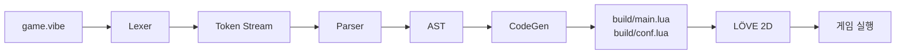

# Phase 1: Minimal Pipeline — v0

## Goal

Vibe 소스코드(.vibe)를 Lua로 변환하여 LÖVE 2D에서 실행하는 최소 파이프라인 구축. 사각형 하나 움직이는 데모까지.

## Tech Stack

- **트랜스파일러**: TypeScript — because LLM 코드 생성 정확도가 가장 높아 개발 속도 극대화
- **파서**: Hand-written Recursive Descent — because 순수 들여쓰기(INDENT/DEDENT) 처리를 PEG 라이브러리가 제대로 지원하지 않음
- **런타임**: LÖVE 2D (Lua) — because 기존 엔진을 빌려 쓰는 단계적 전략
- **CLI**: Node.js + TypeScript — because 트랜스파일러와 동일 언어로 통합

## Architectural Decisions

- **파이프라인 3단계**: Lexer → Parser → CodeGen — because v0에서 타입 체커 없이 시작하여 파이프라인 연결을 우선 검증
- **INDENT/DEDENT 토큰화**: 렉서가 들여쓰기를 가상 토큰으로 변환 (Python tokenizer 방식) — because 파서가 블록 구조를 중괄호처럼 처리 가능
- **v0 키워드 범위**: 7개 (`fn`, `let`, `const`, `if`, `else`, `return`, `for`) — because 파이프라인 전체 연결이 목표, 나머지 키워드는 파이프라인 작동 후 점진 추가
- **게임 루프 연결**: 이름 컨벤션 기반 — 최상위 `fn update(dt)`, `fn draw()`를 LÖVE의 `love.update`, `love.draw`에 매핑 — because v0에서 어노테이션(@on) 없이 게임 루프를 연결하는 가장 단순한 방법
- **내장 함수**: v0에서 LÖVE 매핑 함수 최소 세트만 제공 (`key_down`, `draw_rect`, `draw_text`, `draw_circle`) — because 데모 실행에 필요한 최소한
- **CLI 명령**: `vibe run <file.vibe>` 하나로 트랜스파일 + LÖVE 실행 — because 개발 경험 단순화
- **출력 구조**: `build/` 디렉토리에 `main.lua` + `conf.lua` 생성 — because LÖVE가 디렉토리 단위로 실행
- **에러 보고**: 파일명 + 줄번호 + 에러 메시지 — because 디버깅 최소 요건

## Constraints

- Must: Lexer, Parser, CodeGen은 독립 모듈로 분리
- Must: 생성된 Lua는 수정 없이 `love build/`로 실행 가능
- Must: LÖVE 2D가 시스템에 설치되어 있어야 함 (자동 설치 안 함)
- Must not: v0에서 어노테이션(@entity, @on 등) 처리하지 않음
- Must not: v0에서 타입 체커 구현하지 않음 (타입 어노테이션은 파싱하되 무시)
- Must not: v0에서 모듈 시스템 구현하지 않음 (단일 파일만)

## 파이프라인 흐름



## Scope

**In scope**:
- Lexer (토큰화 + INDENT/DEDENT 변환)
- Parser (7개 키워드에 대한 AST 생성)
- CodeGen (AST → Lua 소스 변환)
- CLI (`vibe run`)
- 내장 함수 최소 세트 (LÖVE API 매핑)
- 사각형 움직이는 데모

**Out of scope**: 타입 체커, enum/match, struct/trait/has, 어노테이션, 모듈 시스템, 에디터 통합

## v0 검증 기준

이 Vibe 코드가 LÖVE에서 실행되면 Phase 1 v0 완료:

```
let x: Float = 400.0
let y: Float = 300.0
let speed: Float = 200.0

fn update(dt: Float)
  if key_down("right")
    x = x + speed * dt
  if key_down("left")
    x = x - speed * dt
  if key_down("down")
    y = y + speed * dt
  if key_down("up")
    y = y - speed * dt

fn draw()
  draw_rect(x, y, 32, 32)
```

## v0 이후 검토 방향 (확정 아님 — v0 사용 경험 후 결정)

- 타입 체커 추가
- enum/match/struct/trait/has 지원
- 어노테이션 시스템 (@entity, @on)
- 모듈 시스템 (use)
- 복합 대입 연산자 (+=, -= 등)
- 핫 리로드
- 소스맵 (Lua 에러 → Vibe 줄번호 역매핑)
- LSP 서버
